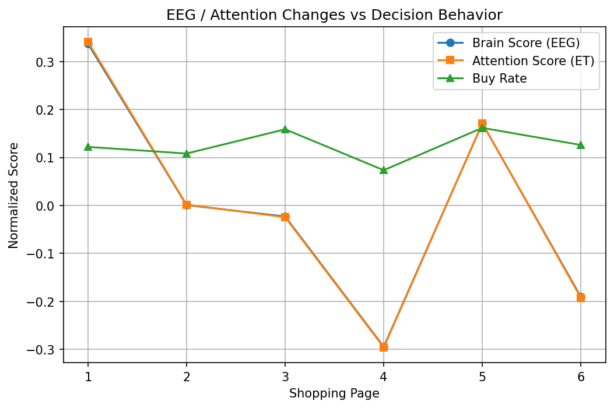
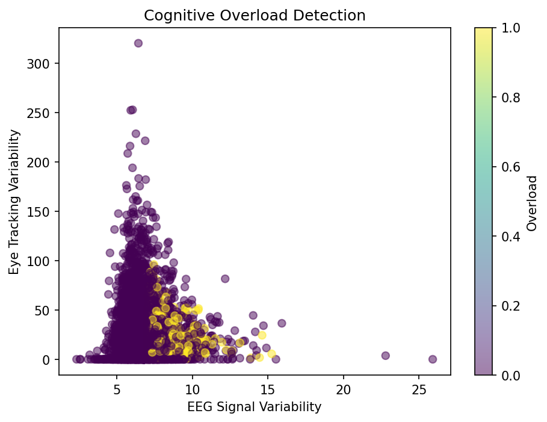
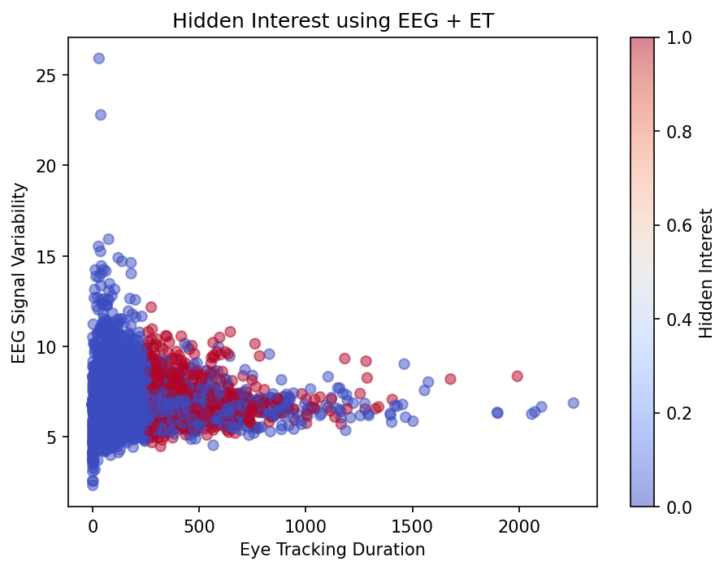

# 🧠 Neuromarketing Consumer Decision Predictor

> **Predicting consumer decision reversals using multimodal biometric signals — where brainwaves and eye movements reveal what self-reported surveys cannot.**


---

## Table of Contents

1. [Project Overview](#project-overview)
2. [Key Features and Methodology](#key-features-and-methodology)
3. [Data Dictionary](#data-dictionary)
4. [Model Architecture](#model-architecture)
5. [Evaluation Strategy](#evaluation-strategy)
6. [Visualisations](#visualisations)
7. [Results](#results)
8. [Installation and Setup](#installation-and-setup)
9. [Usage](#usage)
10. [Team Collaboration](#team-collaboration)
11. [Future Improvements](#future-improvements)
12. [Citation](#citation)

---

## Project Overview

### The Business Problem

Traditional market research relies on surveys and self-reported intent — but consumers frequently *change their minds*. A shopper may show strong initial interest in a product (high attention, active brain engagement) yet ultimately walk away. This phenomenon, a **decision reversal**, is invisible to conventional analytics but leaves measurable traces in biometric data.

This project builds a machine learning pipeline to **predict decision reversals before they happen**, using synchronized EEG (brainwave) and Eye-Tracking signals recorded while participants browsed a simulated supermarket.

### Why This Matters

| Traditional Approach | This Approach |
| --- | --- |
| Post-hoc surveys | Real-time biometric signals |
| Self-reported intent | Objective neural & gaze data |
| Binary buy/no-buy | Detects *reversal* — the change of mind |
| Misses subconscious cues | Captures hidden interest & cognitive overload |

For retailers, brands, and UX researchers, a model that can flag "this consumer is about to change their mind" is a direct lever for intervention — better product placement, pricing nudges, or UI redesign.

### What is a Decision Reversal?

A **decision reversal** occurs when a consumer demonstrates high early engagement (elevated attention scores and brain activity during the first half of a shopping session) but then significantly reduces purchasing behavior in the second half. It is the gap between *implicit interest* and *explicit action* — and it is precisely what this model is trained to detect.

The label is engineered from the temporal trajectory of each subject's biometric signals across 6 shopping pages:

- **Early engagement** (Pages 1–3): mean attention score and brain score
- **Late behavior** (Pages 4–6): mean attention score, brain score, and purchase rate
- A reversal is flagged when early engagement drops significantly and late purchase rate falls below 10%

---

## Key Features and Methodology

### 1. Raw Signal Parsing from `.mat` Files

Each subject's data is stored in a MATLAB `.mat` struct containing:

- **EEG_clean**: 19-channel EEG at 300 Hz (shape: `19 × 110,400`)
- **ET_clean**: 6-channel Eye-Tracking at 120 Hz (shape: `6 × 43,200`)
- **6 shopping pages × 24 products** per subject, each with time-stamped segment indices

The pipeline parses these nested structs using `scipy.io.loadmat` and dynamically handles variable-length segment arrays per product.

### 2. Custom Feature Engineering

Rather than feeding raw waveforms directly, the pipeline extracts interpretable statistical features per product-viewing episode:

| Feature Group | Features Extracted |
| --- | --- |
| **Segment Geometry** | `n_segments`, `total_len`, `mean_len`, `std_len` |
| **Signal Statistics** | `signal_mean`, `signal_std`, `signal_abs_mean` |
| **Composite Scores** | `attention_score` (ET-derived), `brain_score` (EEG-derived) |

**Attention Score** is a weighted composite of eye-tracking engagement:

```text
attention_raw = 0.35 × et_n_segments + 0.45 × et_total_len + 0.20 × et_signal_abs_mean
```

**Brain Score** mirrors this for EEG:

```text
brain_raw = 0.35 × eeg_n_segments + 0.45 × eeg_total_len + 0.20 × eeg_signal_abs_mean
```

Both scores are z-score normalized across the full dataset.

### 3. Derived Behavioral Labels

Three behavioral labels are engineered from the composite scores:

- **Hidden Interest** — High attention + high brain activity, but no purchase (top 25th percentile on both scores, `buy_label = 0`)
- **Cognitive Overload** — High fixation count + high EEG variance, but no purchase (top 40th percentile)
- **Decision Reversal** — Subject-level label: early engagement drops, late purchase rate < 10%

### 4. Dynamic Sequence Handling

For sequential models (LSTM, GRU, CNN), the pipeline reshapes the tabular features into time-series sequences ordered by `page → product_num`, enabling the model to learn the *temporal trajectory* of engagement across a shopping session.

### 5. Class Imbalance Strategy

The dataset is heavily imbalanced (decision reversals: 16 out of 42 subjects). The pipeline addresses this with:

- `class_weight` balancing during training
- F1-Score on the minority class as the primary evaluation metric
- Leave-One-Out Cross-Validation (LOOCV) to maximize use of the small subject pool

---

## Data Dictionary

**Dataset**: [NeuMa PreProcessed — A Multimodal Neuromarketing Dataset](https://figshare.com/articles/dataset/NeuMa_PreProcessed_A_multimodal_Neuromarketing_dataset/22117124)

**42 subjects**, each viewing **6 pages × 24 products** = 6,048 product-level observations.

### Input Features (per product-viewing episode)

| Feature | Source | Description |
| --- | --- | --- |
| `attention_score` | Eye-Tracking | Z-normalized composite of fixation count, total gaze duration, and signal amplitude |
| `brain_score` | EEG | Z-normalized composite of EEG segment count, total neural activity duration, and absolute amplitude |
| `eeg_n_segments` | EEG | Number of distinct EEG activity segments during product viewing |
| `eeg_total_len` | EEG | Total duration (samples) of EEG activity |
| `eeg_signal_mean` | EEG | Mean amplitude across all EEG channels and segments |
| `eeg_signal_std` | EEG | Standard deviation of EEG amplitude (proxy for neural variability) |
| `eeg_signal_abs_mean` | EEG | Mean absolute amplitude (proxy for overall neural engagement) |
| `et_n_segments` | Eye-Tracking | Number of distinct fixation/gaze segments |
| `et_total_len` | Eye-Tracking | Total gaze duration (samples) |
| `et_signal_mean` | Eye-Tracking | Mean gaze signal value |
| `et_signal_std` | Eye-Tracking | Standard deviation of gaze signal |
| `et_signal_abs_mean` | Eye-Tracking | Mean absolute gaze signal |
| `familiarity` | Survey | Self-reported product familiarity score |
| `frequent_buy` | Survey | Self-reported purchase frequency for the product |

### Target Variable

| Label | Level | Description |
| --- | --- | --- |
| `decision_reversal` | Subject-level | **Primary target.** 1 if the subject showed high early engagement but low late purchasing behavior |
| `hidden_interest` | Product-level | 1 if high biometric engagement but no purchase |
| `cognitive_overload` | Product-level | 1 if high fixation count and EEG variance but no purchase |

---

## Model Architecture

Five model families are trained and compared:

### 1. MLP (Multilayer Perceptron)

Baseline tabular model. Fully connected layers on flattened feature vectors. Achieves F1 = 0.6667 with balanced precision (0.75) and recall (0.60) — a strong, lightweight baseline.

### 2. 1D CNN

Applies convolutional filters along the temporal (page sequence) dimension to detect local engagement patterns. The best-performing model overall: F1 = 0.75, Accuracy = 95.24%, and perfect precision (1.00) — every flagged reversal is correct.

### 3. LSTM (Long Short-Term Memory)

Captures long-range dependencies in the engagement trajectory across the shopping session. Achieves F1 = 0.5455 — competitive recall (0.60) but limited by the small subject pool, which constrains recurrent model generalization under LOOCV.

### 4. GRU (Gated Recurrent Unit)

A computationally lighter alternative to LSTM. Achieves perfect precision (1.00) but very low recall (0.20), making it too conservative for practical deployment at this dataset size.

### 5. Hybrid CNN + LSTM

Combines a 1D CNN feature extractor with an LSTM sequence modeler. Despite its architectural sophistication, it achieves the lowest F1 (0.2857) — the hybrid likely overfits on small LOOCV training folds without sufficient regularization.

All deep learning models are built with **TensorFlow/Keras** and trained with:

- `Adam` optimizer
- `binary_crossentropy` loss
- `class_weight` balancing for the minority class
- Early stopping on validation loss

---

## Evaluation Strategy

**Leave-One-Out Cross-Validation (LOOCV)** is used given the small subject pool (42 subjects). In each fold, one subject is held out as the test set and the model is trained on the remaining 41.

**Primary metric**: F1-Score on the minority class (decision reversal = 1)

This is the correct metric here because:

- Accuracy is misleading on imbalanced data (a model predicting "no reversal" always would score ~62%)
- The cost of a false negative (missing a reversal) is higher than a false positive in a real deployment scenario
- Decision thresholds are tuned per model to optimize the precision/recall trade-off

---

## Visualisations

The notebook generates three key plots that illustrate the multimodal signal patterns underlying each behavioural label.

### EEG Brain Score vs Decision Change Across Shopping Pages



> Brain Score (EEG) and Attention Score (ET) track almost identically across all 6 shopping pages — confirming the two modalities capture the same underlying engagement signal. Both drop sharply from page 1 to page 4, while the Buy Rate fluctuates independently. This temporal divergence between biometric engagement and purchase behaviour is the core pattern the models learn to detect as a decision reversal.

### EEG Instability vs Eye-Tracking Variability (Cognitive Overload)



> Consumers with simultaneously high EEG signal variance and high eye-tracking duration variability are flagged as cognitively overloaded — a state associated with decision fatigue and non-purchase.

### Hidden Interest — EEG Signal Variability vs Eye-Tracking Duration



> Red points (Hidden Interest = 1) cluster at high EEG variability and long gaze duration despite no purchase — revealing subconscious engagement that self-reported surveys would miss entirely.

---

## Results

All metrics are reported on the **minority class (decision reversal = 1)** using Leave-One-Out Cross-Validation across 42 subjects. Decision thresholds were tuned per model to optimize the F1-Score on the reversal class.

| Rank | Model | Threshold | Accuracy | Precision | Recall | F1-Score |
| --- | --- | --- | --- | --- | --- | --- |
| 🥇 | **1D CNN** | 0.6 | **0.9524** | **1.0000** | 0.6000 | **0.7500** |
| 🥈 | MLP | 0.6 | 0.9286 | 0.7500 | 0.6000 | 0.6667 |
| 🥉 | LSTM | 0.4 | 0.8810 | 0.5000 | 0.6000 | 0.5455 |
| 4 | GRU | 0.6 | 0.9048 | **1.0000** | 0.2000 | 0.3333 |
| 5 | CNN + LSTM | 0.6 | 0.8810 | 0.5000 | 0.2000 | 0.2857 |

### Key Takeaways

**1D CNN is the clear winner** (F1 = 0.75, Accuracy = 95.24%) with perfect precision — every reversal it flags is a true reversal. This is the most deployable model in a real retail setting where false alarms erode trust and trigger unnecessary interventions.

**MLP is a strong second** (F1 = 0.6667), matching the 1D CNN on recall (0.60) while trading some precision for a simpler, faster architecture. A solid choice when computational resources are limited.

**LSTM ranks third** (F1 = 0.5455), achieving the same recall as the top two models but with lower precision. Despite being theoretically well-suited for temporal sequence modeling, its performance is constrained by the small 42-subject pool — recurrent models need more data to generalize reliably under LOOCV.

**GRU achieves perfect precision** (1.00) but extremely low recall (0.20), meaning it only flags reversals it is highly certain about. It misses 80% of actual reversals, making it too conservative for practical use at this dataset size.

**CNN + LSTM underperforms** despite its architectural complexity (F1 = 0.2857). The hybrid model likely overfits on the small training folds, a known failure mode when combining convolutional and recurrent layers without sufficient data regularization.

**The core finding**: convolutional architectures (1D CNN) outperform recurrent ones (LSTM, GRU, CNN+LSTM) on this dataset. The local pattern detection of convolutions is more robust under LOOCV with 42 subjects than the long-range dependency modeling of recurrent layers, which requires larger datasets to generalize.

---

## Installation and Setup

### Prerequisites

- Python 3.10+
- A Kaggle account (recommended for GPU access) or a local environment with TensorFlow GPU support

### 1. Clone the Repository

```bash
git clone https://github.com/aindri1974/Neuromarketing-Consumer-Decision-Predictor.git
cd Neuromarketing-Consumer-Decision-Predictor
```

### 2. Install Dependencies

```bash
pip install -r requirements.txt
```

### 3. Download the Dataset

The project uses the **NeuMa PreProcessed** dataset — a publicly available multimodal neuromarketing dataset containing EEG and Eye-Tracking recordings from 42 participants.

**Download here**: [https://figshare.com/articles/dataset/NeuMa_PreProcessed_A_multimodal_Neuromarketing_dataset/22117124](https://figshare.com/articles/dataset/NeuMa_PreProcessed_A_multimodal_Neuromarketing_dataset/22117124)

After downloading, place the `.mat` files in the following directory structure:

```text
Neuromarketing-Consumer-Decision-Predictor/
├── assets/
├── data/
│   ├── S01.mat
│   ├── S02.mat
│   └── ... (all 42 subject files)
├── neuromarketing-consumer-decision-predictor.ipynb
├── neuromarketing_consumer.csv
├── requirements.txt
└── README.md
```

### 4. Update the Dataset Path

In the notebook, update the `DATASET_DIR` variable to point to your local data folder:

```python
DATASET_DIR = "./data"   # or the full path to your downloaded .mat files
```

---

## Usage

### Running on Kaggle (Recommended)

1. Upload the notebook to [Kaggle](https://www.kaggle.com)
2. Add the NeuMa PreProcessed dataset as a data source
3. Enable GPU accelerator under **Settings → Accelerator → GPU**
4. Click **Run All**

### Running Locally

Launch Jupyter and open the notebook:

```bash
jupyter notebook neuromarketing-consumer-decision-predictor.ipynb
```

Run all cells in order. The notebook is structured as follows:

```text
Section 1  → Environment setup & imports
Section 2  → Dataset loading and structure inspection
Section 3  → Feature extraction from .mat files
Section 4  → Label engineering (attention score, brain score,
             hidden interest, cognitive overload, decision reversal)
Section 5  → Model training (MLP, CNN, LSTM, GRU, CNN+LSTM)
             LOOCV evaluation loop
Section 6  → Results summary and model comparison
Section 7  → Visualisations
```

---

## Team Collaboration

This project was developed as part of an academic research initiative by a **4-person team** using an **ensemble programming** methodology — a synchronous, collaborative development approach where all team members actively contributed to every stage of the pipeline simultaneously.

Rather than dividing the work into isolated modules, the team co-developed the entire codebase together: from the initial `.mat` file parsing and feature engineering design, through the model architecture decisions, to the LOOCV evaluation framework. This approach ensured shared ownership of every design decision, immediate peer review of all logic, and a consistent coding style throughout.

Ensemble programming is a deliberate choice for research-grade ML work where the cost of a silent bug in preprocessing or label engineering is high — having multiple sets of eyes on every line of code is a meaningful quality control mechanism.

---

## Future Improvements

- **Raw waveform modeling**: Feed the full EEG time series directly into a temporal convolutional network (TCN) or transformer, bypassing hand-crafted feature extraction
- **Frequency-domain features**: Add EEG band power (delta, theta, alpha, beta, gamma) as additional inputs — these are well-established correlates of attention and cognitive load in the neuromarketing literature
- **Cross-subject generalization**: Explore domain adaptation techniques to improve LOOCV performance across subjects with very different baseline neural profiles
- **Larger dataset**: The 42-subject pool limits model capacity, particularly for recurrent architectures. Combining NeuMa with other public neuromarketing datasets could significantly improve LSTM and GRU performance
- **Real-time inference**: Package the trained model as a lightweight inference API that processes streaming EEG/ET data with sub-second latency for in-store deployment
- **Explainability**: Apply SHAP or LIME to identify which biometric features most strongly predict a reversal — actionable insight for product designers and retail strategists

---

## Citation

If you use the NeuMa PreProcessed dataset in your work, please cite the original authors:

```text
NeuMa PreProcessed: A multimodal Neuromarketing dataset
Available at: https://figshare.com/articles/dataset/NeuMa_PreProcessed_A_multimodal_Neuromarketing_dataset/22117124
```

---

## Contact

Built by a 4-person academic team. Primary contact: **Aindri Singh**

- GitHub: [@aindri1974](https://github.com/aindri1974)
- LinkedIn: [Aindri Singh](https://www.linkedin.com/in/aindri-singh-077816320/)

---

*This project is for research and portfolio purposes. The dataset is publicly available under its original license terms.*
